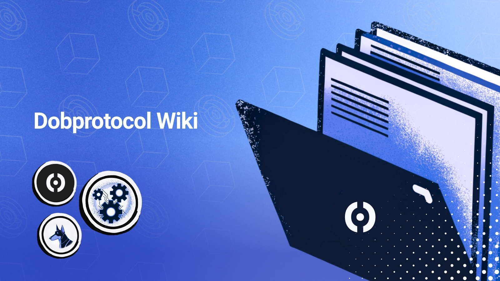

# Dobprotocol Wiki

<figure><figcaption></figcaption></figure>

Here you will find all the essential information about Dobprotocol, the project that is building the infrastructure to validate real-world assets and enable the Machine Economy.

This portal brings together the main concepts, tools, and advances of the protocol in a clear and accessible way.

### DOB WILL BE EVERYWHERE

[Website](https://www.dobprotocol.com/) | [X](https://x.com/dobprotocol) | [LinkedIn](https://www.linkedin.com/company/dobprotocol/) | [Instagram](https://www.instagram.com/dobprotocol/) | [Telegram](https://t.me/dobprotocol_official) | [Linktree](https://linktr.ee/dobprotocol)

<table data-view="cards"><thead><tr><th></th><th></th><th data-hidden data-card-cover data-type="files"></th><th data-hidden></th><th data-hidden data-card-target data-type="content-ref"></th></tr></thead><tbody><tr><td><strong>Dobrotocol in simple words</strong></td><td>Because someone had to make the financial layer of the Machine Economy.</td><td><a href=".gitbook/assets/2 (1).jpg">2 (1).jpg</a></td><td></td><td><a href="dobprotocol-simple-words/">dobprotocol-simple-words</a></td></tr><tr><td><strong>Dobprotocol Platform</strong></td><td>A powerful plaform that combines blockchain, AI, and robust validation layers.</td><td><a href=".gitbook/assets/Copia de Copia de Intro to the world of Hackathons (Post de Twitter).png">Copia de Copia de Intro to the world of Hackathons (Post de Twitter).png</a></td><td></td><td><a href="dob-ecosystem/overview.md">overview.md</a></td></tr><tr><td><strong>Dob Validator</strong></td><td>Prove real revenue before unlocking decentralized funding.</td><td><a href=".gitbook/assets/3 (1).jpg">3 (1).jpg</a></td><td></td><td><a href="dob-ecosystem/overview-1/">overview-1</a></td></tr></tbody></table>
