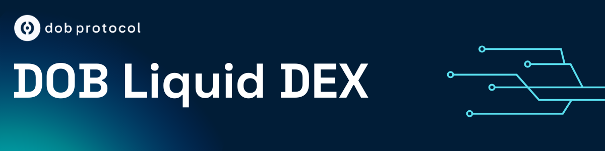
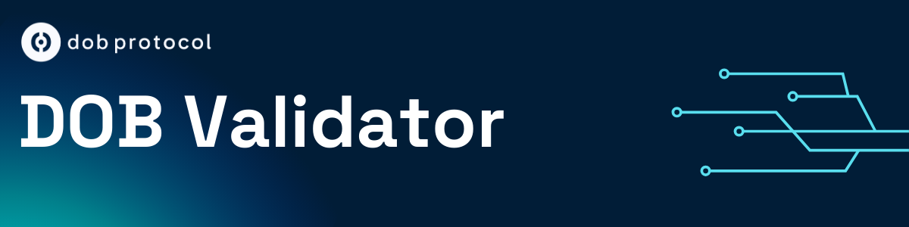
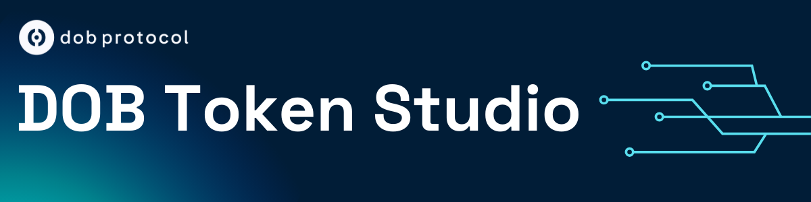
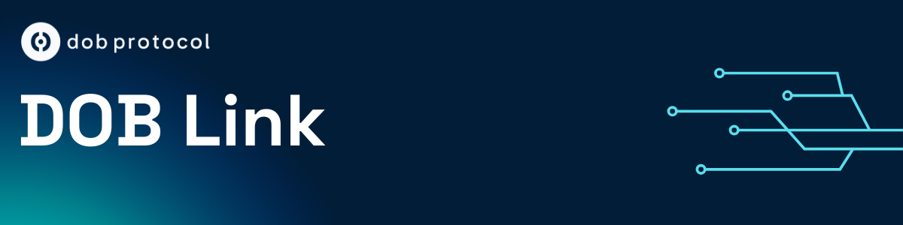
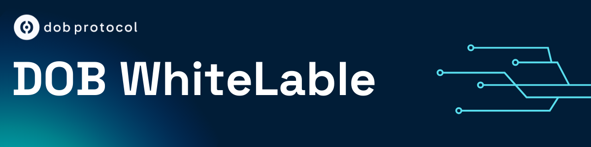

# About DOB (V2)

<figure><figcaption></figcaption></figure>

DOB Protocol is your starting point for Real World Asset Tokenization.

We offer a modular, scalable, secure and compliant solution to meet the needs of:

* **Investors** who want to invest resources in this market without the risk of acquiring illiquid assets.
* **Projects** that need capital to finance their operations.
* **Financial Agents** and **Development Teams** who work with digital asset tokenization.

Our solutions do not only address technical requirements. In addition to being easy to use, they are also ready to offer the legal security required in these operations.

***

## Solutions

DOB Protocol offers a complete suite of B2C and B2B solutions for Real World Asset (RWA) tokenization.&#x20;

<figure><figcaption></figcaption></figure>



<figure><figcaption></figcaption></figure>

Invest starting from USD 10.00. Buy and sell whenever you want. Pricing based on real performance of tokenized Projects.

<a href="https://dobprotocol.com/" class="button primary">Discover our DEX</a>



<figure><figcaption></figcaption></figure>

Certify and Approve your Project with real auditable data and access investors worldwide.

<a href="dob-ecosystem-v1/overview-1/" class="button primary">Learn more</a>



<figure><figcaption></figcaption></figure>

Tokenize your operation and access capital without banks, abusive interest rates or capital dilution.

<a href="dob-ecosystem-v1/overview.md" class="button primary">Explore the platform</a>



<figure><figcaption></figcaption></figure>

Offer access to your project tokens in a simple and secure way on your own website or wherever you want. No programming required.

Automatic double yield: real revenue + DeFi returns.

<a href="dob-ecosystem-v1/overview-2/" class="button primary">See how it works</a>



<figure><figcaption></figcaption></figure>

Financial Agents and Development Teams no longer need to recruit internal teams of programmers and lawyers to offer Tokenized products. Scale with our solutions. End-to-end or modular implementation.

<a href="investor-data-room-v2.md" class="button primary">Learn More</a>

***

## Dob Token (DOB)

<figure><figcaption></figcaption></figure>

The DOB Token is the gateway to our solutions. By acquiring this token you can:

* &#x20;**Fast-Track Onboarding:** Projects using DOB have full priority in onboarding and immediate access to the platform.
* **Cost Reduction:** Pay protocol fees with DOB and get exclusive discounts.
* **Premium Data and Intelligence:** Access advanced dashboards and exclusive strategic insights.
* **Active Governance:** Vote on critical decisions and participate directly in the protocol evolution.
* **Staking:** Lock DOB and receive recurring rewards.

DOB is not just a token - it is competitive advantage for those who operate in the DOB Protocol ecosystem.


**Legal Notice and Risks:** DOB Protocol is subject to the laws of Bermuda and exclusive jurisdiction of the courts of Bermuda. Operations conducted through a regulated structure (Class IIGB and DABA Class M) with statutory segregated accounts that provide legal asset segregation. Investments in Real World Asset (RWA) tokens involve significant risks, including total loss of invested capital. Recourse limited exclusively to assets linked to the specific segregated account. The protocol implements multiple layers of risk mitigation, including continuous performance validation, auditable on-chain registration and programmatic liquidity. Not available to residents of prohibited jurisdictions (including USA, OFAC sanctioned countries and FATF blacklisted countries). Past performance does not guarantee future results. Investors should seek independent professional advice. [Consult complete documentation on risks and mitigations](https://dobprotocol-wiki.gitbook.io/dobprotocol-wiki/investor-data-room).


***

**Last update:** January 2026
