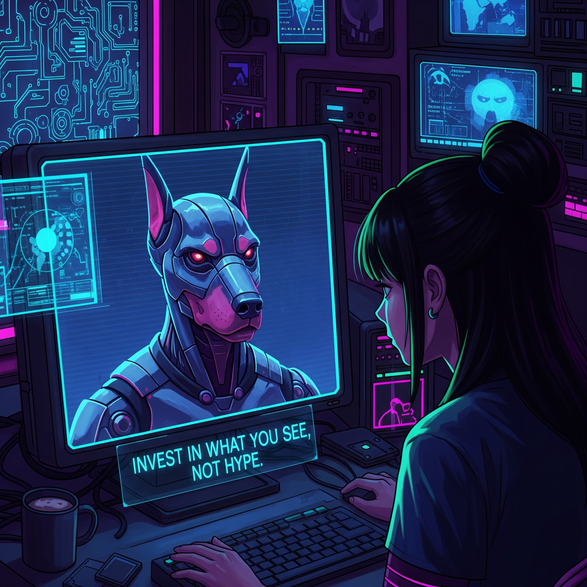
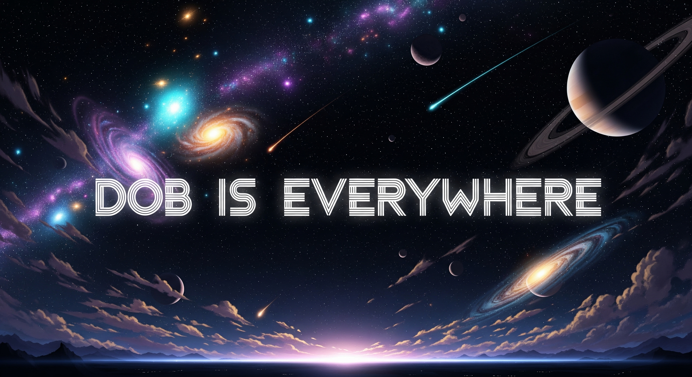

# Comic

<figure><figcaption></figcaption></figure>

The Dobprotocol comic was born as a creative way to share our **history** and vision for the Machine Economy. Instead of long technical documents, we wanted to create something engaging that could capture imagination while explaining what we are building.

It became a source of **inspiration** for our team and community alike — a visual narrative that brings machines, people, and decentralized networks together into a story that feels alive. Through characters and illustrations, the comic shows how trust, transparency, and innovation can reshape finance and infrastructure.

Created by Andrés Peña, between August 1 and 5, 2025, with ChatGPT, Ideogram, Photopea, and Gemini.

Presented at Tellus' Ideaton for Stellar, Content Bounty.

Chapter 1: A quiet night

<figure><figcaption></figcaption></figure> <figure><figcaption></figcaption></figure> <figure><figcaption></figcaption></figure> <figure><figcaption></figcaption></figure>

Chapter 2: Financial layer

<figure><figcaption></figcaption></figure> <figure><figcaption></figcaption></figure> <figure><figcaption></figcaption></figure> <figure><figcaption></figcaption></figure>

Chapter 3: Infratalks

<figure><figcaption></figcaption></figure> <figure><figcaption></figcaption></figure> <figure><figcaption></figcaption></figure> <figure><figcaption></figcaption></figure>

Chapter 4: The lighthouse

<figure><figcaption></figcaption></figure> <figure><figcaption></figcaption></figure> <figure><figcaption></figcaption></figure> <figure><figcaption></figcaption></figure>

Chapter 5: Dob is everywhere

<figure><figcaption></figcaption></figure> <figure><figcaption></figcaption></figure> <figure><figcaption></figcaption></figure> <figure><figcaption></figcaption></figure>

