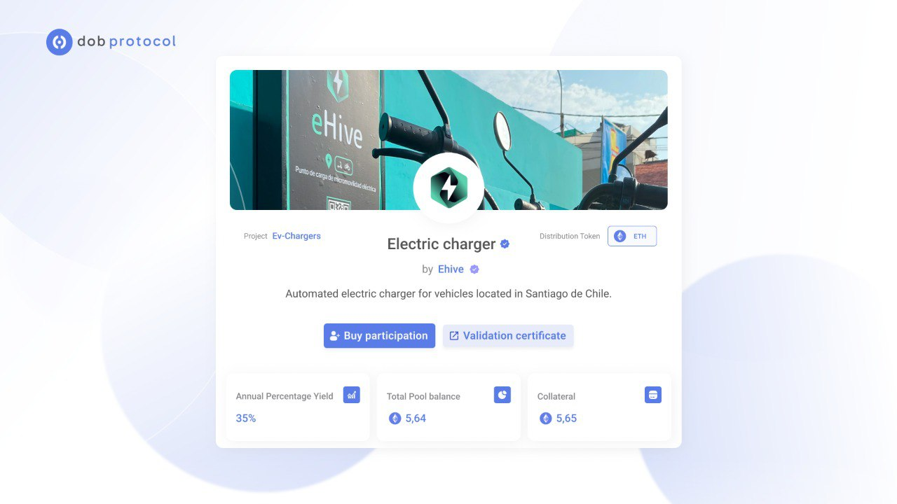

# First use case: eHive

[eHive](https://ehive.cc/) is the first infrastructure operator to go live on Dobprotocol. Founded by [Juan Oyanedel](https://www.linkedin.com/in/juan-oyanedel-858537b7/), eHive installs and manages smart electric vehicle chargers across Chile and Perú.

Through eHive, you invest in accessible, efficient, and sustainable charging solutions that accelerate electric mobility adoption, driving us toward a greener future.

<figure><figcaption></figcaption></figure>

Your investment earns income from companies, fleets, and individual users seeking EV charging solutions.

* **Large fleets:** 38 chargers at DHL Pudahuel Plant.
* **Offices & buildings:** Chargers at PepsiCo Maipú, Smart Vicuña Building, and the Swiss Embassy.
* **Communities:** Multiple installations in residential buildings in Ñuñoa and La Florida.

EV charging infrastructure is a capital-intensive industry. Through Dobprotocol, eHive turns these machines into revenue-generating, blockchain-verified assets accessible to global backers.

🔗 Learn more: [ehive.cc](https://ehive.cc/)
