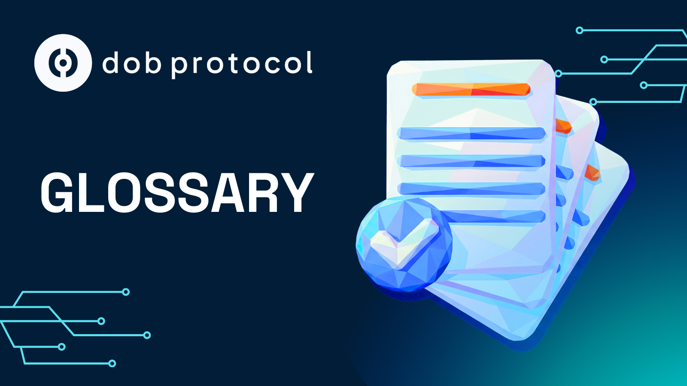

# Glossary (V2)

<figure><figcaption></figcaption></figure>

This document presents the main terms used in DOB Protocol documentation, including technical, legal, product, and academic concepts, organized alphabetically for quick reference.

***

## A

### Account Assets

Assets linked to a specific segregated account within a SAC company. In the Bermuda regulatory context used by DOB Protocol, Account Assets are the assets that back the tokens of a specific Investment Round and are legally isolated from assets of other segregated accounts or the General Account. Token Holders have limited recourse exclusively to the Account Assets of the segregated account that backs their tokens, ensuring legal protection through Bermuda's SAC Act.

### Account Owner

Owner of a segregated account (Segregated Account) within a SAC company. In the Bermuda regulatory context used by DOB Protocol, the Account Owner is the Project Owner or entity that holds rights over tokenized assets in a specific segregated account. The Account Owner has exclusive access to assets linked to their account and cannot access assets from other segregated accounts or the general account.

### Asset Validation

One of the three dimensions of validation performed by DOB Validator. Evaluates physical characteristics, location, provenance, depreciation, and technical certifications of the asset when applicable.

### Advocate - Trustworthy Evidence

System proposed by Fernando Castillo (CTO of DOB Protocol) for generating and maintaining reliable evidence in cloud computing systems, presented in his paper "Advocate—Trustworthy Evidence in Cloud Systems" (6th Conference on Blockchain Research & Applications, 2024). Advocate allows creating verifiable proofs of events, operations, and system states that can be independently audited. DOB Protocol's on-chain metadata system incorporates principles similar to Advocate, where validation metadata anchored on the Stellar blockchain creates permanent evidence that investors can independently verify.

### AMMs (Automated Market Makers)

Automated market protocols that facilitate token trading without the need for direct counterparts. DOB Protocol integrates with AMMs to increase the composability of RWA tokens.

### APR (Annual Percentage Rate)

Annual percentage rate that represents the expected return on an investment. **Note:** DOB Protocol is standardizing the use of APY (Annual Percentage Yield) instead of APR for greater accuracy and consistency, as APY includes compounding effects.

### APY (Annual Percentage Yield)

Annual percentage rate that includes compounding effects, representing the real expected return on an investment. **Standard adopted:** DOB Protocol has standardized the use of APY across the platform to avoid confusion between different return metrics and ensure comparability between projects. APY is more accurate than APR as it reflects the real return considering reinvestments.

***

## B

### BackOffice CMS

Content management system used internally by the DOB Protocol team to review, comment, and score project submissions in DOB Validator. Allows the team to publish verified metadata directly on the Stellar blockchain using Soroban smart contracts.

### Business Model Validation

One of the three dimensions of validation performed by DOB Validator. Evaluates financial viability, revenue structure, profitability, and sustainability of the project's business model.

### Base

Ethereum-derived Layer-2 blockchain used by DOB Protocol for deploying investment rounds and DEX operations. Base offers reduced transaction costs while maintaining security and compatibility with Ethereum. [Learn more](https://base.org/)

### BMA (Bermuda Monetary Authority)

Monetary and regulatory authority of Bermuda responsible for supervising financial services, including insurance, banking, and digital asset activities. DOB Protocol operates under Bermuda's regulatory context through BMA supervision, using regulated structures that include Class IIGB and DABA Class M licenses. BMA operates frameworks such as the Regulatory Sandbox and Innovation Hub to support innovation in the financial sector. [Learn more](https://www.bma.bm/)

### Blockchain

Distributed ledger technology that enables secure and immutable transactions. DOB Protocol uses blockchain (Ethereum, Base, and Stellar) to ensure transparency, auditability, and security of tokenization and revenue distribution operations. [Learn more](https://ethereum.org/en/what-is-ethereum/)

***

## C

### Cashflow

Cash flow generated by projects and Real World Assets. In DOB Protocol, cashflow is continuously monitored and recorded on-chain through DOB Validator, ensuring that only verified revenues are distributed to investors.

### Certificate

Document that proves the validation of a project through DOB Validator. The certificate highlights: verified Project Owner identity, company identity, Project Owner's track record, Execution Score, evidence of compliance, and financial viability.

### Chained Verifiable Computations

Sequence of verifiable computations where each step depends on the successful verification of the previous step. The result of each computation serves as input for the next, creating a chain of trust. Fernando Castillo (CTO of DOB Protocol) proposed a specific framework for chained verifiable computations in his paper "Trusted Compute Units: A Framework for Chained Verifiable Computations" (arXiv preprint, 2025). DOB Validator's validation process follows multiple chained steps (Project Owner Validation → Business Model Validation → Asset Validation), where each step generates evidence necessary for the next, enabling complete tracking of the validation process.

### Class IIGB (Innovative Insurer General Business)

Insurance license category under Bermuda's Insurance Act 1978 for insurers offering innovative products and services. In the Bermuda regulatory context used by DOB Protocol, companies that graduate from the Regulatory Sandbox frequently receive Class IIGB licenses. Ensuro Re Limited, which provides legal structure for DOB Protocol operations, holds a Class IIGB license. [Learn more](https://www.bma.bm/insurance-innovation)

### CMS (Content Management System)

Content management system. In the context of DOB Protocol, refers to the BackOffice CMS used to manage the project validation process.

### Composability

Ability of tokens and protocols to interact and integrate with other DeFi protocols. DOB Protocol ensures that RWA tokens are composable with AMMs, lending pools, and vaults.

### Credential-Based Device Registration

Device registration system based on cryptographic credentials that enables authentication and validation of physical devices in decentralized applications (DApps) for DePIN (Decentralized Physical Infrastructure Networks) networks. Fernando Castillo (CTO of DOB Protocol) proposed a specific credential-based device registration system using Zero-Knowledge Proofs in his paper "Towards Credential-Based Device Registration in DApps for DePINs with ZKPs" (IEEE International Conference on Blockchain, 2024). DOB Validator uses credentials to validate Project Owner identity and physical devices, with validation metadata anchored on the Stellar blockchain using Soroban smart contracts.

### Cryptographic Trail

Auditable cryptographic trail that records events, operations, and system states in an immutable and verifiable manner. Each entry in the trail is cryptographically linked to previous ones, creating a chain of evidence. Each validated project in DOB Protocol has an auditable cryptographic trail, where performance and distributions are recorded on-chain creating verifiable history. Investors can audit the entire history of a tokenized project.

***

## D

### DABA (Digital Asset Business Act 2018)

Bermuda law that regulates digital asset business activities. In the Bermuda regulatory context used by DOB Protocol, the protocol operates through structures that hold DABA licenses, specifically DABA Class M, which allows issuance and management of digital tokens. DABA establishes compliance requirements, KYC/AML, and investor protections. [Learn more](https://www.bma.bm/)

### DABA Class M

Specific license category under Bermuda's Digital Asset Business Act 2018. In the Bermuda regulatory context used by DOB Protocol, this license allows issuance, sale, and redemption of digital tokens, as well as related custody operations. The DABA Class M license is maintained through the General Account and can be used by segregated accounts for tokenization activities. [Learn more](https://www.bma.bm/)

### DeFi (Decentralized Finance)

Decentralized financial system built on blockchain that enables financial services without traditional intermediaries. DOB Protocol integrates with DeFi protocols to maximize capital efficiency. [Learn more](https://ethereum.org/en/defi/)

### DeFindex

DeFi protocol on the Stellar network where yields generated on Base are automatically reinvested through DobLink, creating the "double yield" effect.

### DePIN (Decentralized Physical Infrastructure Networks)

Decentralized physical infrastructure networks. DOB Protocol solves trust problems in the DePIN space through verifiable validation and cryptographic proofs.

### Draper University

Private entrepreneurship institution founded in 2012 by Tim Draper, located in San Mateo, California. Known for intensive entrepreneurship programs that combine practical training with industry leader talks, aiming to empower future entrepreneurs. In 2025, DOB Protocol was the winner of two programs in partnership with Draper University and Stellar: "Stellar X Draper University Founder Residency 2025" (July) and "Stellar x Draper Embark Program" (August).

### Distribution Fee

Distribution fee applied to all revenues generated by validated projects. In DOB Protocol, it is 0.5% deducted before distribution to investors.

### DOB Liquid RWA DEX

The first liquid DEX for Real World Assets, powered by Uniswap v4 Hooks. Allows anyone to invest, trade, and freely exit RWA investments, with a minimum investment of just $10 USD. Uses Uniswap v4 Hooks supported by revenue flows to provide integrated liquidity for all listed RWA tokens.

* Solves the structural problem of illiquid onchain RWAs.
* Eliminates dependence on non-existent or artificial secondary markets.
* Removes need for liquidity dependent on OTC or manual market makers.
* Allows exit before maturity through partial exit mechanisms.
* Creates dynamic pricing based on real performance.Reflects risk in price through programmatic liquidity.
* Eliminates simulated liquidity by offering real and programmatic liquidity.
* Solves the problem of pools that collapse under stress.
* Makes RWAs truly DeFi-native.
* Enables integration with AMMs, lending pools, and vaults.
* Makes tokens composable with the DeFi ecosystem.

### DOB Protocol

Protocol that connects Real World Assets with global investors through simple and transparent WEB3 on-chain infrastructure. Transforms Real World Assets into verified and investable assets. Operates through a regulated structure in Bermuda with statutory segregated accounts that provide legal asset segregation. The protocol's focus is on Real World Asset Tokenization, allowing projects to access capital and investors to invest in tokenized RWAs without the risk of acquiring illiquid assets.

### DOB Token

Native token of DOB Protocol that serves as the gateway to solutions. Offers fast-track onboarding, cost reduction, access to premium data, active governance, and staking.

### DOB Token Studio

Decentralized platform that allows investing in Real World Assets that generate verifiable on-chain revenue. Its main function is to make projects investable, trustworthy, and transparent through tokenization. Solves traditional friction of high-interest loans, opaque underwriting, and lack of trust in infrastructure. Project Owners request financing for real-world projects, the protocol opens Investment Rounds, future revenue is used as collateral, and investors contribute capital. Revenue flows back to investors transparently.

* Eliminates capital access barriers for small and medium infrastructure that cannot access traditional banking.
* Solves collateral requirements misaligned with operational reality.
* Replaces credit based on historical balance sheet with real performance-based assessment.
* Reduces dependence on CAPEX-intensive with long payback and irregular flows.
* Offers capital raising times compatible with operations.
* Reduces excessive dependence on sponsors or highly dilutive equity.
* Provides financial products adapted to productive projects.
* Reduces high financial costs for non-institutional operators.
* Eliminates need for expensive legal structures (SPV, lawyers).
* Reduces prohibitive legal costs for small operators.

### DOB Validator

Official validation system of DOB Protocol. Serves as the entry point for Real World Assets and projects that wish to be verified, tokenized, and financed through the protocol. No project can access capital in DOB Protocol without going through DOB Validator. Validation covers three dimensions: Project Owner Validation, Business Model Validation, and Asset Validation (when applicable). The system combines structured forms, document uploads, scoring, and metadata anchoring on blockchain, ensuring that only valid and financeable projects reach the market. Each project has an auditable cryptographic trail, eliminating information asymmetry between Project Owner and investor.

* Replaces manual trust with verifiable proof.
* Eliminates lack of reliable standard for project validation.
* Solves problem of reported but unverified performance.
* Eliminates declared but unproven revenue.
* Provides cryptographic proofs of real operation.
* Eliminates total information asymmetry between Project Owner and investor.
* Solves problem of offchain trust that doesn't scale onchain.
* Eliminates fragmented or manipulable operational data.
* Reduces excessive dependence on operator reputation.

### DobLink

Solution that allows Project Owners to embed investment opportunities directly on their websites through an embeddable widget, creating frictionless paths to invest in tokenized projects. Solves the problem of static gains through "double yield": automatic reinvestment of yields in DeFindex on Stellar, making capital work twice without user intervention.

* Eliminates access barriers to infrastructure investment for retail investors.
* Removes investment restrictions reserved only for funds or large tickets.
* Reduces geographical and regulatory barriers.
* Eliminates extreme friction for non-crypto-native investors.
* Makes infrastructure composable with wallets.
* Solves lack of investor network for Project Owners.
* Facilitates token distribution.
* Provides integrated distribution channels.
* Offers market access for tokens.
* Solves problem of good yield but immobilized capital through double yield.

### Dober

Operational account of DOB Protocol used to process automatic revenue distributions to investors. The Dober account address initially pays network fees, which are later reimbursed by the Investment Round after distribution is completed. This account facilitates efficient batch distribution processing.

### Dob Whitelabel

Modular plug and play infrastructure of DOB Protocol that solves technical and operational challenges of financial agents working with tokenization. Can be applied as a global solution or to meet specific needs. Eliminates the need for internal blockchain teams, reduces high costs of custom development, and offers stable tokenization APIs. Provides ready operational dashboards, reusable modular legal structures, and built-in compliance in the product.

* Eliminates need for custom modular plug and play infrastructure.
* Reduces complexity of fragile technical integrations.
* Provides stable tokenization APIs.
* Removes dependence on internal blockchain teams.
* Reduces high costs of custom development.
* Offers ready operational dashboards.
* Provides highly configurable infrastructure.
* Enables scalability without design limitations.
* Solves problems of legal costs that spike due to customization.
* Facilitates reuse of legal structures.
* Offers built-in compliance in the product.
* Enables scaling without constant need for lawyers.
* Accelerates enterprise client onboarding.
* Standardizes validation processes between projects.
* Eliminates manual validation that doesn't scale through reusable standards.

### Double Yield

Effect created by DobLink where investors earn returns from projects that are automatically reinvested in DeFi protocols on Stellar, making capital work twice without user intervention.

***

## E

### Ensuro Re Limited

Ensuro Re Limited is the licensed and regulated company in Bermuda through which DOB Protocol operates in regulatory and legal terms. The company was incorporated in 2021 and holds multiple regulatory authorizations that ensure all operations occur within a clear and internationally recognized legal framework.

In the context of DOB Protocol, Ensuro Re Limited provides the legal and regulatory structure that enables the protocol to operate through statutory segregated accounts, ensuring legal segregation of assets and liabilities for each tokenized project. Each project tokenized through DOB Protocol can have its assets linked to a specific segregated account within Ensuro Re Limited's structure, ensuring legal protection through Bermuda's SAC Act (Segregated Accounts Companies Act 2000).

The company underwent a rigorous validation process in the Bermuda Monetary Authority (BMA) Regulatory Sandbox and graduated from the program in April 2024, receiving complete authorizations that demonstrate the ability to operate in a regulated and secure manner.


**Company Information**

* **Name:** Ensuro Re Limited
* **Type:** Exempted company incorporated under the laws of Bermuda
* **Registration Number:** 202100534
* **Registered Office:** Crawford House, 50 Cedar Avenue, Hamilton HM 11, Bermuda
* **Role in DOB Protocol:** Legal entity through which the protocol operates in regulatory and legal terms, providing structure for statutory segregated accounts


| Compliance                                           | Description                                                                                                                                                                                                                                                                                                                                                                                                                                                               | Type          | Status    |
| ---------------------------------------------------- | ------------------------------------------------------------------------------------------------------------------------------------------------------------------------------------------------------------------------------------------------------------------------------------------------------------------------------------------------------------------------------------------------------------------------------------------------------------------------- | ------------- | --------- |
| **Class IIGB** (Innovative Insurer General Business) | Insurance license under Bermuda's Insurance Act 1978 that allows operating as an insurer with innovative products. Provides a solid regulatory foundation for operations involving risk management and asset protection. Ensuro Re Limited graduated from the Bermuda Monetary Authority (BMA) Regulatory Sandbox on April 30, 2024, receiving a full Class IIGB license after validation by experienced regulators.                                                      | License       | Active    |
| **Segregated Accounts Company (SAC)**                | Certification under the SAC Act (Segregated Accounts Companies Act 2000). Allows Ensuro Re Limited to create and manage segregated compartments, making possible the system of separate accounts that protects each tokenization.                                                                                                                                                                                                                                         | Certification | Active    |
| **DABA Class M**                                     | Specific authorization for operations with digital assets under Bermuda's Digital Asset Business Act 2018, including issuance, sale, and management of tokens. Maintained by the General Account, can be used by all segregated compartments. Establishes compliance requirements, including KYC/AML (Know Your Customer/Anti-Money Laundering) procedures, ensuring operation within international standards for prevention of money laundering and terrorism financing. | License       | Active    |
| **Regulatory Sandbox**                               | Ensuro Re Limited graduated from the Bermuda Monetary Authority (BMA) Regulatory Sandbox on April 30, 2024, receiving a full Class IIGB license.                                                                                                                                                                                                                                                                                                                          | Program       | Graduated |

### eHive

First operational use case of DOB Protocol. Digital platform to manage, monitor, and monetize electric vehicle charging stations, focused on Santiago, Chile (Green Mobility).

### ERC20

Token standard on the Ethereum blockchain that defines a common set of rules for fungible tokens. DOB Protocol's Participation Tokens follow the ERC20 standard. [Learn more](https://ethereum.org/en/developers/docs/standards/tokens/erc-20/)

### Ethereum

Blockchain that establishes the EVM (Ethereum Virtual Machine) standard with which DOB Protocol is compatible. The protocol is developed in Solidity and operates primarily on Base, an Ethereum-derived Layer-2 blockchain that offers reduced transaction costs while maintaining EVM compatibility. This compatibility allows DOB Protocol to expand to other EVM-compatible networks in the future. Through the rollup mechanism, operations on Base indirectly utilize Ethereum network security. [Learn more](https://ethereum.org/)

### Estimated Annual Return

Term used to describe APY in a more accessible way for investors. Refers to the return that the investor will receive annually, including compounding effects.

### Eternal Storage Pattern

Storage pattern proposed in 2016 that defines a base structure for storing different types of data. DOB Protocol uses a modification called "Private Eternal Storage" that separates state variables from logic, enabling upgradeability.

### Execution Score

Score that evaluates the execution capacity of a project owner and their project. Based on objective criteria and included in the validation certificate. See also: **Machine Score**.

***

## F

### Factory Pattern

Design pattern used in DOB Protocol through the PoolMaster contract to deploy new Investment Rounds through the Proxy pattern.

### Founder School

Incubation program for entrepreneurs that offers support and resources for startup development. In 2025, DOB Protocol was the winner of the Founder School Incubator Program, demonstrating recognition for its execution capacity and growth potential.

### From R\&D to Code that Becomes Product

Slogan expressing DOB Protocol's core philosophy: transforming academic research into functional products. DOB Protocol is not just code. It is the practical application of years of research conducted by co-founders Fernando Castillo (CTO), Oscar Castillo (CEO), and Simón Espínola (COO). Advanced Trustless Systems concepts underpin the protocol's architecture and working methods. **Usage:** Whenever there is reference to the academic research that underpins DOB Protocol. **Translations:** PT: "Da Pesquisa ao Código que se Torna Produto" | EN: "From R\&D to Code that Becomes Product" | ES: "De la Investigación al Código que se Convierte en Producto". **Application:** Research & Development page, academic sections in Solutions (DOB Validator, etc.), marketing materials about technical foundations. See also: **Research & Development**, **TrustOps**, **TDAM**.

***

## G

### General Account

General account of a SAC company that comprises all assets and liabilities of the company that are not linked to any segregated account. In the Bermuda regulatory context used by DOB Protocol, the General Account maintains regulatory licenses (such as DABA Class M) that can be used by segregated accounts for tokenization activities. General Account assets are separated and protected from segregated account assets.

### GPS Coordinates

Geographic coordinates used in DOB Validator's validation process to verify the physical location of tokenized assets (when applicable).

### Governing Instrument

Governing instrument that establishes the terms and conditions applicable to a specific segregated account. In the Bermuda regulatory context used by DOB Protocol, the Governing Instrument (often a Participation Agreement) defines rights, obligations, and interests of the Account Owner, identifies assets and liabilities linked to the account, and establishes restrictions or special provisions. The Governing Instrument is essential for legal asset segregation under Bermuda's SAC Act.

***

## H

### Hooks (Uniswap v4)

Smart contract plugins introduced in Uniswap v4 that allow customization of liquidity pool operations, swaps, fees, and liquidity positions. Hooks enable developers and liquidity providers to execute actions at specific stages of a pool's lifecycle, such as before or after a swap, or when liquidity is added or removed. This allows for greater customization of liquidity pools and positions. DOB Liquid RWA DEX uses Hooks for programmatic and transparent liquidity management through smart contracts, enabling RWA tokens to have integrated liquidity supported by revenue flows. In December 2025, DOB Protocol was accepted into the Uniswap Hook Incubator, recognizing the protocol's technical innovation in implementing Hooks for Real World Asset liquidity management. [Learn more](https://support.uniswap.org/hc/en-us/articles/30998263256717-What-is-a-hook-on-Uniswap-v4)

***

## I

### Infrastructure Operators

Legacy technical term. See: **Project Owner**. Project owners who need capital to finance their operations. Can raise capital without equity dilution through DOB Protocol, transforming productive assets into investable assets.

### Innovation Hub

Bermuda Monetary Authority framework that offers a structured environment for companies to test new technologies or business models. In the Bermuda regulatory context used by DOB Protocol, the Innovation Hub is applicable for companies that are not currently captured under the Insurance Act 1978 or other financial acts, or that are still developing proof of concept. The Innovation Hub demonstrates BMA's openness to innovation in digital assets.

### Investment Fee

Investment fee applied to each contribution made by investors through the platform. In DOB Protocol, it is 1.5% on each investment.

### Investment Pool

Investment Round where investors contribute capital to finance projects. The Project Owner can define the minimum percentage of participation allowed per user. **Note:** This is an internal technical term. In the interface and public documentation, this concept is referred to as "Investment Round" or "Investment Fund" for better understanding of Web2 users.

### Investment Fund

Alternative term used to describe a tokenized collective investment round. Used as an alternative to the technical term "Pool" for better understanding of Web2 users, offering more familiar terminology for traditional investors. See also: **Investment Round**, **Investment Fund Simulator**.

### Investment Fund Simulator

Tool that allows Project Owners to simulate what an Investment Round would be like for their project, including parameters such as amount to raise, monthly distributions, and expected returns.

### Investment Round

Term used in the interface and public documentation to describe a tokenized collective investment round. Replaces the technical term "Pool" when referring to the Investment Pool or Participation Pool concept of DOB Protocol, facilitating understanding for Web2 users. An investment round allows multiple investors to contribute capital to finance a project, receiving participation tokens in return.

***

## K

### KYC/AML (Know Your Customer / Anti-Money Laundering)

Identity verification and money laundering prevention processes. DOB Protocol implements built-in compliance in the product to facilitate global investor verification. KYC is implemented progressively, allowing users to explore the platform before completing full verification, which is required only to invest or make an Investment Round public. Final responsibility for KYC/AML falls on the licensed entity (DABA Class M).

***

## L

### Limited Recourse

Legal principle where recourse of creditors or investors is limited exclusively to assets linked to a specific segregated account. In the Bermuda regulatory context used by DOB Protocol, Token Holders have limited recourse to Account Assets of the segregated account that backs their tokens, and cannot seek recourse against assets from other segregated accounts or the General Account. This protection is statutorily guaranteed by Bermuda's SAC Act.

### Lisk

Blockchain and development ecosystem that promotes innovation through acceleration programs and recognition. DOB Protocol was recognized as one of the Top 50 startups in Latin America by Rayuela (Lisk) in 2025, in addition to being the winner of Lisk Buildathon by Crecimiento and Lisk Founder Residency at Edge City Patagonia, demonstrating recognition in the Latin American blockchain ecosystem.

***

## M

### Machine Economy

Economy based on machines that work, earn, and share value. DOB Protocol initially focused on building the financial layer of the Machine Economy, allowing productive machines to access global capital. Although Machine Economy remains a valid concept and use case, DOB Protocol's current narrative focuses on Real World Asset Tokenization more broadly, encompassing physical projects, productive systems, and tokenizable RWAs beyond just machines.

### Score

Score assigned to each project through DOB Validator based on objective criteria. The score signals the project's financing capacity. See also: **Execution Score**.

### Metadata

Data about data. In DOB Protocol, verified metadata is anchored on the Stellar blockchain through Soroban smart contracts, creating an auditable cryptographic trail for each project. DOB Validator publishes verified metadata directly on the Stellar blockchain using Soroban smart contracts, BackOffice CMS allows publication of verified on-chain metadata, and the system creates a permanent and auditable record of each validated project.

***

## O

### On-chain

Operations or data recorded directly on the blockchain, ensuring transparency, immutability, and auditability. DOB Protocol records validations, performance, and distributions on-chain, ensuring that only verified revenues are distributed to investors. [Learn more](https://ethereum.org/en/developers/docs/transactions/)

### Operational Address

Dober account address used to process automatic distributions. This address initially pays network fees, which are then reimbursed by the Investment Round after distribution.

### OdiseaLabs

Startup accelerator focused on Web3 and blockchain projects in Latin America. In 2025, DOB Protocol was selected for the OdiseaLabs 2025 accelerator, through which it presented the project to more than 20 Web3 investment funds, facilitating strategic connections and financing opportunities in the Latin American blockchain ecosystem.

***

## P

### Participation Pool

Smart contracts that allow asset trading and reward distribution among shareholders. Investment Rounds act as collective funds where users acquire participation by providing collateral or acquiring portions of the tokenized asset. **Note:** This is an internal technical term. In the interface and public documentation, this concept is referred to as "Investment Round", "Investment Fund", or "Tokenize Project" for better understanding of Web2 users.

### Participation Token

ERC20 tokens used to manage participation in each Investment Round. They are minted only once producing a fixed amount and minimum participation. The total tokens are protected under a locked mint function that prevents creation of new tokens after the initial mint.

### Participation Agreement

Legal agreement that establishes the terms and conditions applicable to a specific segregated account within a SAC company. In the Bermuda regulatory context used by DOB Protocol, the Participation Agreement is frequently used as the Governing Instrument, defining rights, obligations, and interests of the Account Owner, identifying assets and liabilities linked to the account, and establishing restrictions or special provisions. This agreement is essential for legal asset segregation under Bermuda's SAC Act.

### PoolMaster

Smart contract used by DOB Protocol to manage the deployment of new Investment Rounds through the Factory Pattern combined with Proxy Pattern. PoolMaster allows creating multiple Investment Rounds efficiently, each with its own logic and configuration, maintaining upgrade capability through the Proxy pattern.

### Private Eternal Storage

Modification of the Eternal Storage pattern proposed by DOB Protocol that defines three different roles: Guardian, Admin, and User. Ensures private data storage for each user while allowing storage administration.

### Project

Term preferred by users to describe their businesses and initiatives seeking financing. A project can include: Project Owner, business model, assets (when applicable), and track record.

### Project Owner

Person or company that operates a project and seeks financing through DOB Protocol. The project owner is the protagonist of the submission, with verified profile including name/company, RUT, country, LinkedIn, website, social networks, years of experience, previous projects, and aggregated rating. See also: **Verified Project Owner**.

### Prohibited Jurisdictions

Jurisdictions where DOB Protocol operations are not available due to legal or regulatory restrictions. In the Bermuda regulatory context used by DOB Protocol, includes countries on FATF (Financial Action Task Force) blacklist, countries sanctioned by OFAC (Office of Foreign Assets Control), countries sanctioned by the UN, and jurisdictions with securities law restrictions (including United States). The list is periodically updated based on directives from international regulatory authorities.

### Proxy Pattern

Design pattern used in DOB Protocol where a Proxy Contract delegates calls to an Implementation Contract whose address can be changed at any time. Enables upgradeability without changing state variables.

***

## R

### Real World Assets (RWA)

Real-world assets that are tokenized and made available for investment through blockchain. DOB Protocol specializes in Real World Asset tokenization, including physical projects, productive systems, and tokenizable assets that generate verifiable revenue flows.

### Raise Funds

Term used to describe the creation of a tokenized investment round. Related to the concept of capital raising or crowdfunding. See also: **Investment Round**, **Tokenize Project**.

### Regulatory Sandbox

Bermuda Monetary Authority framework that offers a controlled environment for companies to test innovative insurance products and services that may not fit existing regulatory frameworks. In the Bermuda regulatory context used by DOB Protocol, participating companies operate under temporary regulatory relief while demonstrating their business models and compliance capabilities. Companies that successfully graduate receive full licenses (such as Class IIGB). Ensuro Re Limited, which provides structure for DOB Protocol, graduated from the Sandbox.

### Revenue Share

Revenue sharing model where investors receive a percentage of revenues generated by tokenized projects, proportional to their participation in the Investment Round.

### Ring-fencing

Legal and statutory isolation of assets and liabilities of a segregated account, protecting them from claims related to other segregated accounts or the general account. In the Bermuda regulatory context used by DOB Protocol, ring-fencing is guaranteed by the SAC Act and has been consistently maintained by Bermuda courts, even in insolvency cases. Each tokenized project has its assets ring-fenced in a specific segregated account.

### RWA Tokens

Tokens that represent participation in Real World Assets. In DOB Protocol, RWA tokens are created through DOB Token Studio and traded on DOB Liquid RWA DEX.

***

## S

### SAC Act (Segregated Accounts Companies Act 2000)

Bermuda law that allows companies to create statutory segregated accounts to legally segregate assets and liabilities. In the Bermuda regulatory context used by DOB Protocol, the SAC Act establishes the legal framework that enables the protocol to operate through segregated accounts, ensuring that assets of each tokenized project are legally isolated and protected. The law was enacted in 2000 to facilitate the creation of segregated structures without the need for Private Acts of Bermuda's Parliament. [Learn more](https://www.bma.bm/)

### Segregated Account

Statutory segregated account created under Bermuda's SAC Act within a SAC company. A Segregated Account is not a separate legal entity, but rather a record or collection of records that details related transactions. In the Bermuda regulatory context used by DOB Protocol, each tokenized project can have its assets linked to a specific Segregated Account, ensuring legal segregation and asset protection. Assets linked to a Segregated Account are available only to meet liabilities related to that specific account.

### Smart Contracts

Self-executing contracts written in code that are automatically executed when predefined conditions are met. DOB Protocol uses smart contracts to manage Investment Rounds, distributions, and transactions. [Learn more](https://ethereum.org/en/developers/docs/smart-contracts/)

### Solidity

Programming language used to develop smart contracts on the Ethereum blockchain. DOB Protocol is developed in Solidity with support for Ethereum and its derived Layer-2 blockchains. [Learn more](https://soliditylang.org/)

### Soroban

Smart contract platform of the Stellar network. DOB Protocol uses Soroban to publish verified projects on-chain and anchor validation metadata. [Learn more](https://soroban.stellar.org/)

### Stellar Community Fund (SCF)

Program from the Stellar Development Foundation that offers financial and technical support for promising projects building on the Stellar network. The program selects projects with potential for significant impact on the Stellar ecosystem, offering resources and mentorship to accelerate development and adoption. DOB Protocol was the winner of the Stellar Community Fund in two initiatives: **SCF Kickstart #11** and **SCF Build #37**, demonstrating recognition of potential and execution capacity in the Stellar ecosystem. [Learn more](https://www.stellar.org/community-fund)

### SCF Kickstart #11

Initiative of the Stellar Community Fund (SCF) that offers initial support for promising projects on the Stellar network. DOB Protocol was the winner of SCF Kickstart #11 in May 2025, receiving funds and completing all deliverables in just five weeks, with complete submission on July 4, 2025. The program significantly accelerated protocol execution: product delivery, partner onboarding and demand validation.

### SCF Build #37

Initiative of the Stellar Community Fund (SCF) focused on projects that have already demonstrated initial traction and are ready to scale. DOB Protocol was the winner of SCF Build #37, reinforcing strategic recognition in the Stellar ecosystem and demonstrating continuous execution capacity.

### Stellar Network

Blockchain used by DOB Protocol as strategic infrastructure for publishing verified metadata through DOB Validator, utilizing Soroban smart contracts to create auditable cryptographic trails of project validation. DOB Validator publishes verified metadata directly on the Stellar blockchain through BackOffice CMS, establishing permanent and verifiable records that eliminate information asymmetry between Project Owners and investors. Additionally, the Stellar network is also used by DobLink for DeFi operations, including automatic reinvestment of yields in DeFi protocols on Stellar (the "double yield" effect). Stellar offers low transaction costs and global interoperability, being fundamental to DOB Protocol's verifiable trust architecture. [Learn more](https://www.stellar.org/)

***

## T

### Team DOB Protocol

Multidisciplinary team that combines deep expertise in blockchain technology, finance, and business development to create innovative solutions for the future of decentralized finance and real-world asset tokenization. See also: **Oscar Castillo**, **Simón Espínola**, **Fernando Castillo**, **Eduardo Cardoso**, **Ian Dahm**, **Isabela Meza**.

* Oscar Castillo (CEO): With over 10 years of experience in AI, blockchain, and scalable software development, Oscar has successfully led multiple projects including Forcast.tech. His expertise in strategic leadership and technical innovation drives Dobprotocol's vision for decentralized finance and real-world asset tokenization. [LinkedIn](https://linkedin.com/in/opcastil) | [X](https://x.com/opcastil)
* Simón Espínola (COO): Economist with 10+ years in business development across Latin America. He expanded Naturland to 20 commercial establishments and 10 franchises, developing over 100 products, bringing unique insights into scaling operations and sustainable business models. His expertise spans traditional retail to Web3 technologies, driving strategic partnerships and business growth. [Telegram](https://t.me/CryptoSadhu) | [LinkedIn](https://www.linkedin.com/in/simon-espinola-marin-06a78b86/) | [X](https://x.com/Cryptosadhu1)
* Fernando Castillo (CTO): Blockchain specialist and PhD candidate with 4+ years developing decentralized solutions. Combines research expertise with technical leadership, focusing on security and efficiency in Web3 projects. Fernando is author and coauthor of multiple academic papers on trustworthy systems, verifiable computations, and device registration for DePIN networks. [Website](https://shorturl.at/d3Nyh) | [LinkedIn](https://linkedin.com/in/fscastil90120/) | [X](https://x.com/fscastil)
* Eduardo Cardoso (CMO): WEB3 Professional with extensive experience and award-winning projects. BizDev with creative approach and specialist in content, product planning, brand, technology and media, among other subjects related to innovation in Communication, Branding, Design and Advertising. [LinkedIn](https://www.linkedin.com/in/eduardo-cardoso-perfil/) | [X](https://x.com/ecardo5o)
* Ian Dahm (Head of UX and Visual Design): Visual Arts specialist with expertise in UI/UX design and comprehensive graphic design. Leads interface design, user testing, and creates all visual materials including custom icons, illustrations, banners, and the project logo. Ensures intuitive user experiences across all Dobprotocol platforms. [LinkedIn](https://linkedin.com/in/dahm) | [X](https://x.com/dahm)
* Isabela Meza (Graphic Designer): Graphic designer bringing a fresh perspective to our design process and brand identity, her expertise in branding and visual communication positions businesses in the digital market, promoting digital experiences as part of human development. [LinkedIn](https://www.linkedin.com/in/isabela-meza-morales-14a80b24a/)

### Tokenization

Process of converting Real World Assets into tradable digital tokens on the blockchain. DOB Protocol offers tokenization of verified revenues from Real World Assets through DOB Token Studio. [Learn more](https://ethereum.org/en/developers/docs/standards/tokens/)

### Tokenization-as-a-Service (TaaS)

Tokenization service offered by DOB Token Studio that allows Project Owners to tokenize their projects without the need for internal blockchain teams or advanced technical knowledge.

### Tokenize Project

Action of creating tokens that represent participation in a validated project. Term used in the interface as an alternative to the technical term "Create Investment Round". See also: **Investment Round**, **Raise Funds**.

### Token Holders

Holders of participation tokens (Participation Tokens) issued in an Investment Round. Token Holders have rights to revenues generated by the tokenized project, proportionally to their participation in the Investment Round. In the Bermuda regulatory context used by DOB Protocol, Token Holders have limited recourse exclusively to Account Assets of the segregated account that backs their tokens, ensuring legal protection through Bermuda's SAC Act.

### Track Record

Performance history of a Project Owner, including previous projects, payment rate, total raised, number of satisfied investors, and payment behavior. Track record is a critical element in project validation and building trust with investors.

### Trusted Compute Units (TCU)

Framework proposed by Fernando Castillo (CTO of DOB Protocol) for chained verifiable computations that allows creating trustworthy computation units where each processing step can be verified and validated cryptographically, presented in his paper "Trusted Compute Units: A Framework for Chained Verifiable Computations" (arXiv preprint, 2025). The framework allows building chains of trust through multiple verification steps. DOB Validator implements multiple chained validation dimensions (Project Owner Validation, Business Model Validation, Asset Validation), where each validation step generates on-chain anchored evidence, enabling continuous verification of performance and revenue through verifiable data chains.

### TrustOps

Software development methodology proposed by Fernando Castillo (CTO of DOB Protocol) that integrates trust-building practices continuously into the development cycle, presented in his paper "TrustOps: Continuously Building Trustworthy Software" (EDOC 2024 Workshops - iRESEARCH, 2024). TrustOps emphasizes creating verifiable and auditable evidence at each stage of the development process. DOB Validator was developed with nearly 320 transparently documented commits, verified metadata is anchored on-chain creating an auditable trail for each project, and the system implements continuous validation of performance and revenue.

### Trustworthy Decentralized Autonomous Machines (TDAM)

Concept proposed by Fernando Castillo (CTO of DOB Protocol), Simón Espínola (COO of DOB Protocol), and Oscar Castillo (CEO of DOB Protocol) for decentralized autonomous machines that operate reliably through cryptographic verification mechanisms and execution proof, presented in their paper "Trustworthy Decentralized Autonomous Machines: A New Paradigm in Automation Economy" (arXiv preprint, 2025). In the context of DOB Protocol, these machines represent productive systems (physical or digital infrastructure) that can be validated, tokenized, and financed through the protocol. DOB Validator validates projects before allowing access to capital, each project has an auditable cryptographic trail, and performance and revenue are continuously verified and recorded on-chain.

### Trustworthy Evidence

Concept of evidence that can be independently verified and that proves the occurrence of events, execution of operations, or existence of specific states. Trustworthy evidence is immutable, auditable, and cryptographically verifiable. Fernando Castillo (CTO of DOB Protocol) researched specific applications of trustworthy evidence in cloud computing systems in his paper "Advocate—Trustworthy Evidence in Cloud Systems" (6th Conference on Blockchain Research & Applications, 2024). DOB Validator generates trustworthy evidence of project validation, on-chain anchored metadata serves as permanent evidence, and investors can independently verify project validation.

***

## U

### Uniswap v4

Latest version of the Uniswap protocol that introduces Hooks for custom logic in liquidity pools. DOB Liquid RWA DEX is the first liquid DEX for RWA powered by Uniswap v4 Hooks. In December 2025, DOB Protocol was accepted into the Uniswap Hook Incubator, recognizing the protocol's technical innovation in implementing Hooks for Real World Asset liquidity management. [Learn more](https://uniswap.org/)

### Upgradeable Logic

Upgradeable logic system implemented in DOB Protocol through the combination of Proxy Pattern, Eternal Storage, and Storage/Logic pattern. Allows each Investment Round owner to decide whether to update their logic to a new version or not.

***

## V

### Validator

Validation system that verifies existence, operation, and revenue generation of Real World Assets and projects. In DOB Protocol, DOB Validator is mandatory for any project to access capital.

### Verified Project Owner

Project owner who has passed DOB Validator's validation process, with verified identity, validated company, and proven track record. Verified project owners receive a visible label "Project Owner validated by DOB Protocol" and have access to advanced platform features.

### Verifiable Computations

Computations that can be verified by third parties without needing to re-execute the complete calculation. They use cryptographic proofs (such as Zero-Knowledge Proofs) to demonstrate that a computation was executed correctly. DOB Validator generates verifiable proofs of project validation, investors can verify validations without re-executing the entire process through the auditable trail, and the system reduces information asymmetry between Project Owners and investors.

***

## W

### Widget

Embeddable component that can be integrated into websites. DobLink functions as an embeddable widget that allows direct investment in tokenized projects without leaving the Project Owner's platform.

***

## Y

### Yield

Return generated by an investment. In DOB Protocol, yields are generated through verified real revenues from tokenized projects and distributed proportionally to investors according to their participation in the Investment Round. **Note:** DOB Protocol has standardized the use of APY to describe yields, ensuring it includes compounding effects.

***

## Z

### Zero-Knowledge Proofs (ZKPs)

Established cryptographic protocols that allow proving knowledge of information without revealing the information itself. ZKPs are a cryptographic technology widely used since the 1980s. In the context of device registration, ZKPs can be used to validate ownership and identity without exposing sensitive data. Fernando Castillo (CTO of DOB Protocol) researched specific applications of ZKPs in device registration for DePIN networks in his paper "Towards Credential-Based Device Registration in DApps for DePINs with ZKPs" (IEEE International Conference on Blockchain, 2024). DOB Protocol's validation system can potentially use ZKPs to protect sensitive information from Project Owners, enable compliance verification without exposing complete personal data, and facilitate cross-validation between different parts of the ecosystem. [Learn more](https://ethereum.org/en/developers/docs/scaling/zk-rollups/)

***

Last updated: January 2026

Version: 7.0
