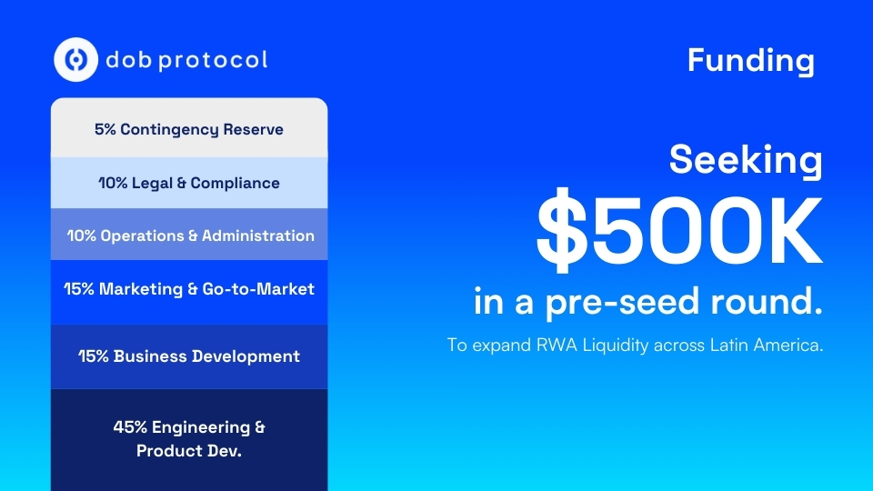

# Investor Data Room (V2)

<figure><figcaption></figcaption></figure>

DOB Protocol: Your starting point for Real World Asset Tokenization.

Real-world assets produce real value. But financing them is slow, complex, and limited.

* Tokenizing assets is expensive.
* There is no liquidity for this class of Real World Assets (RWA).
* Investors don't trust what they cannot verify.
*
  Project Owners struggle to raise capital without debt or capital dilution.

Thus, projects remain underfunded. And value remains locked.

<figure><figcaption></figcaption></figure>


DOB Protocol connects real projects with global investors through simple, transparent, and compliant WEB3 on-chain infrastructure.

***

#### Project Owners

Raise capital for their projects without losing ownership or control of their businesses.

***

#### Financial Agents and Development Teams

Offer tokenized products without recruiting internal teams of programmers and lawyers, scaling with modular solutions and embedded compliance.

***

#### Investors

Participate through collective investment structures, backed by real and auditable project performance yields.

* NO banks.
* NO dilution.
* NO traditional debt.

DOB Protocol transforms real-world projects into verified and investable assets. Everything is traceable, compliant, and built for scale. Just projects, performance, and shared value.


## THE SOLUTION: DOB PROTOCOL

**DOB Protocol** offers a complete ecosystem of modular, scalable, secure, and compliant solutions for Real World Asset (RWA) tokenization. Our 5 solutions work together to solve the main challenges of the real-world asset tokenization market.



#### Dob Liquid DEX

The First Liquid RWA DEX powered by Uniswap v4 Hooks.

* Programmatic liquidity based on real revenue flows from projects
* Anyone can invest, trade, and exit freely
* Minimum investment: just USD 10.00
* Dynamic pricing that reflects real project performance in real time
* Native DeFi: tokens compatible with AMMs, lending pools, and vaults from day one

Dob Liquid DEX transforms structurally illiquid RWAs into truly tradeable assets with programmatic liquidity.



#### Dob Validator

Projects are verified. Performance and cash flow are continuously monitored and recorded on-chain. Only validated assets enter the DEX.

* Cryptographic validation with verifiable proof of existence, operation, and revenue
* Auditable operation trail that eliminates information asymmetry
* Real data-based scoring
* Global access to investors through verifiable credibility

Dob Validator is the official entry point for projects that want to be verified, tokenized, and financed through DOB Protocol.



#### Dob Token Studio

Verified project revenue is packaged into investable digital assets (RWA tokens). This tokenization infrastructure powers the DEX, creating liquid markets for real-world assets.

* Tokenization based on future revenue as collateral, not historical
* Transparent Investment Rounds without losing equity participation
* Ready legal structure: tokenize in days, not months
* Revenue flows automatically to investors

Dob Token Studio offers access to capital without traditional intermediaries, eliminating access barriers for small and medium-sized projects.



#### Dob Link

Offer access to your project's tokens simply and securely on your own website or wherever you want.&#x20;

* Embeddable widget on your site without programming
* Automatic double yield: real revenue + DeFi returns
* Wallet integration: geographic distribution without barriers
* Direct sale on your own site without intermediaries



### DOB WhiteLabel

Strategic solution for Financial Agents and Development Teams who want to offer tokenized products without recruiting internal teams of programmers and lawyers. Scale with our solutions through end-to-end or modular implementation.

Ready APIs and reusable modular legal structures\
Operational dashboards ready for immediate use\
Compliance embedded in the product\
Fast time to market: onboard enterprise clients in days, not months

***

## How it Works



#### Verify

Projects are validated and performance data recorded on-chain via DOB Validator.



#### Tokenize

Verified revenue is packaged into RWA tokens via DOB Token Studio, creating transparent Investment Rounds.



#### Invest and Trade

Tokens are listed on DOB Liquid DEX for free trading, with distribution via DOB Link and programmatic liquidity.



#### **Financial Agents and Development Teams**

**Financial Agents and Development teams** can integrate DOB Protocol solutions in a modular or end-to-end manner, using documented APIs and ready legal structures.&#x20;




DOB Protocol offers a complete integrated suite of software and legal compliance for Real World Asset tokenization. Our modular solutions combine on-chain technical infrastructure with regulated legal structures, enabling real-world projects to access global capital without traditional intermediaries.

We build the bridge to unlock billions in untapped project value across emerging markets. Where others see risk, we deliver proof through verifiable validation, transparent tokenization, and embedded compliance.

DOB Protocol is not just a concept, but an operational platform generating real value through tokenization of electric vehicle charging projects, with a fully functional DEX marketplace.


***

## TRACTION: OPERATIONAL PROOF POINTS

<figure><figcaption></figcaption></figure>

### eHive: Operational Use Case

About the Project:

* Digital platform to manage, monitor, and monetize electric vehicle charging stations
* Focus: Santiago, Chile (Green Mobility)
* Website: https://ehive.cc

Figure: eHive project card showing APY and pool balance.

***

### Chargers in the Marketplace

Charger #173: Status "Trusted", available for purchase (Price USD 8.5K, APR 15%)\
Charger #171: Status "Trusted", available for Airdrop\
Charger #172: Status "Trusted", available for Airdrop

* USD 40K tokenized
* Tokens available for investment (purchase or airdrop)

***

### Metrics

Functional marketplace: https://dobprotocol.com

Location: El Bosque 433, Las Condes, Santiago, Chile

USD 250K (value of tokenized assets)

10+ projects in pipeline

USD 10M in tokenizable future revenue

More than 7 RWA platforms want to be on DOB Protocol

***

### Pipeline

**Bas 3:** Tokenization in process

***

## RISKS & MITIGATIONS

DOB Protocol operates at the intersection of real-world projects, verified performance data, and on-chain liquidity. As an early-stage protocol, the main risks and mitigations are:

 <strong>Real-World Performance Risk</strong>

Physical assets may underperform, impacting yield.

✅ **DOB Mitigation:** Only projects with real-time validated performance and revenue are onboarded via DOB Validator. Underperforming assets cannot sustain token issuance.

<strong>Data Integrity &#x26; Trust Risk</strong> 

Inaccurate or manipulated data could affect investor confidence.

✅ **DOB Mitigation:** Performance and revenue are continuously verified and recorded on-chain, creating auditable and tamper-resistant data flows.

<strong>Liquidity Risk</strong>

RWA markets are structurally illiquid, limiting exits.

✅ **DOB Mitigation:** Liquidity is engineered, not assumed, through programmatic mechanisms and Uniswap v4 Hooks backed by revenue flows. The DEX provides built-in liquidity for all listed RWA tokens.

<strong>Smart Contract &#x26; Protocol Risk</strong>

Smart contract vulnerabilities or integration failures may impact operations.

✅ **DOB Mitigation:** Modular architecture, staged deployments, and reliance on battle-tested DeFi primitives reduce systemic exposure.

<strong>Regulatory &#x26; Compliance Risk</strong>

Regulatory treatment of tokenized revenue may evolve.

✅ **DOB Mitigation:** The protocol focuses on revenue participation, not asset ownership, with jurisdiction-aware onboarding and LATAM-first deployment.

<strong>Adoption &#x26; Execution Risk (Pre-Seed)</strong>

Project Owner adoption and early execution risks remain.

✅ **DOB Mitigation:** Clear incentives for Project Owners (capital without debt or dilution), operational proof points (eHive), and strong ecosystem partners.


**Risk Philosophy**

DOB Protocol does not remove risk. It makes risk visible, measurable, and liquid through verified performance and programmatic liquidity.


***

## Business Model

Our business model is designed to be sustainable, scalable, and aligned with the interests of Project Owners and capital providers. DOB Protocol earns fees at the protocol level through token flows, while creating new opportunities for token holders to participate in platform growth.

<figure><figcaption></figcaption></figure>

### Investor-Side Fees

**Investment Fee:** 1.5% fee applied to each contribution made by investors through the platform.

***

### Revenue-Share Fees

**Distribution Fee:** 0.5% of all revenue generated by validated projects, deducted before distribution to investors.

***

### Validation + Tokenization Pricing

Project Owners pay a one-time fee to access DOB Validator and the tokenization process. Price depends on project scale and complexity:

| Tier   | Fee (USD)   | Expected Project Type                             |
| ------ | ----------- | ------------------------------------------------- |
| Small  | USD 4,500   | Projects up to USD 250K, installations            |
| Medium | USD 9,000   | Projects between USD 250K–USD 1M                  |
| High   | USD 18,000+ | Large-scale or high-complexity projects (>USD 1M) |


#### DOB White Label: Commercialization

DOB White Label is commercialized under consultation, and adapted to the specific needs of each Financial Agent or Development Team. Contact us to discuss modular or end-to-end implementation, API integration, operational dashboards, and reusable legal structures according to your scale and requirements.


***

## WHO IT'S FOR: Buyer Personas



#### Project Owners

Access capital without dilution or traditional debt. Transform productive projects into investable assets through verifiable validation and tokenization, raising capital directly from global investors via DEX.

**Flow:**\
Validation via DOB Validator → Tokenization via Dob Token Studio → Distribution via Dob Link → Listing on DEX.

**Use cases:**

* SaaS platforms with monthly subscriptions
* Farms measuring and validating grain production
* Factories delivering consumer-ready products
* Mining fleets: GPUs and AI clusters
* Solar and renewable energy
* Electric vehicle charging networks
* Industrial robots
* Data and IoT infrastructure


**Any Productive System can be addressed by DOB Protocol**

Any system that generates reliable and measurable data can be understood as a Productive System and addressed by DOB Protocol. A SaaS platform with monthly subscription, a farm validating grain production, or a factory delivering consumer-ready products become investable when performance becomes visible and verifiable. This perspective shapes how we build the protocol: any Productive System with measurable data can be tokenized, enabling performance assessment and predictable revenue projections.




#### Financial Agents and Development Teams (Builders and Service Providers)

Scalable infrastructure for the future of real-world finance. Integrate tokenized revenue models into real-world projects through DOB White Label.

**Typical flow:**\
End-to-end or modular implementation via DOB White Label → Onboard enterprise clients → Operational dashboards ready → Embedded compliance.

**Benefits:**

* Scale without internal teams of programmers or lawyers
* Fast time to market: onboard enterprise clients in days, not months
* Controlled costs: without expensive custom development
* Total flexibility: modular implementation as needed



#### Investors (Retail and Institutional)

Access to real returns backed by projects through the Liquid RWA DEX. Transparent, verifiable, and globally accessible alternative investment opportunities outside traditional finance.

**Typical flow:**\
Invest → Yields generated → Reinvestment/composability → Returns distributed on-chain.

**Benefits:**

* Minimum investment of USD 10.00 eliminates entry barriers
* Programmatic liquidity: exit when you want, without being locked until maturity
* Fair pricing based on real project performance
* Native DeFi integration: capital works on multiple fronts simultaneously



***

## PRE-SEED Round Resume

<figure><figcaption></figcaption></figure>

## Projections

<figure><figcaption></figcaption></figure>

***

## TEAM

<table data-view="cards"><thead><tr><th align="center"></th><th align="center"></th><th align="center"></th><th data-hidden data-card-cover data-type="image">Cover image</th></tr></thead><tbody><tr><td align="center"><strong>Óscar Castillo</strong></td><td align="center"><em>Co-founder &#x26; CEO</em></td><td align="center">With over 10 years of experience in AI, blockchain, and scalable software development, Oscar has successfully led multiple projects.</td><td><a href=".gitbook/assets/1720463970913.png">1720463970913.png</a></td></tr><tr><td align="center"><strong>Fernando Castillo</strong></td><td align="center"><em>Co-founder &#x26; CTO</em></td><td align="center">Fernando Castillo is a founder, blockchain specialist, and PhD candidate with 4 years of experience developing decentralized and scalable solutions.</td><td><a href=".gitbook/assets/Design sem nome (46).png">Design sem nome (46).png</a></td></tr><tr><td align="center"><strong>Simón Espínola</strong></td><td align="center"><em>Co-founder &#x26; COO</em></td><td align="center">Simón leads operations and business execution at DOB Protocol. 10 years of experience leading business development and commercial strategy across Latin America.</td><td><a href=".gitbook/assets/1752805246370.png">1752805246370.png</a></td></tr></tbody></table>

***

## BUILDING MOMENTUM: OUR FIRST YEAR (2025)

<figure><figcaption></figcaption></figure>

### Q1: Early Traction

* **January:** Built and delivered prototype in less than 24h (Red Pill Challenge — Virtuals)
* **February:** Best Consumer Product at Aleph Mantle Hackathon | 2nd place at AVAX Chile Pitch Demo Day
* **March:** Top50 startup LatAm by Rayuela (Lisk) | Selected for OdiseaLabs 2025 accelerator

***

### Q2-Q4: Recognition and Acceleration

* **June:** Finalists at ApeCon Miami 2025 | Finalists at Virtuals Hackathon 2025
* **July:** Winners of Stellar X Draper University Founder Residency 2025 | Winners of Founder School Incubator Program
* **August:** Winners of Stellar x Draper Embark Program
* **September:** Presented DOB Protocol at Meridian (Stellar)
* **October:** Winners of Lisk Buildathon by Crecimiento | Winners of Lisk Founder Residency at Edge City Patagonia
* **November:** Pitch presented at Crecimiento SWC
* **December:** Accepted into Uniswap Hook Incubator | Hosted DOB Machine Day 2025


DOB Protocol is built in the open and with the community. We work closely with Stellar, Draper U, Tellus Cooperative and regional partners across Latin America to scale adoption, compliance, and on-chain interoperability. Our stacks bridge Base (where Investment Rounds are deployed) and Stellar (where DeFi reinvestment and interoperability happen), creating a cross-chain flow that multiplies capital efficiency.


***

## OUR PARTNERS & ECOSYSTEM

### Strategic Investors

* **Stellar:** Strategic investment (1%)
* **Draper University:** Strategic investment (1%)

***

### Accelerators & Incubators

* **Uniswap Hook Incubator:** Accepted to create the First Liquid RWA DEX
* **Stellar X Draper University:** Founder Residency (Winners)
* **Lisk Foundation:** Founder Residency at Edge City Patagonia (Winners)
* **OdiseaLabs:** 2025 accelerator

***

### Recognition

* **Stellar Build Award:** USD 143k
* **Top50 startup LatAm:** Rayuela (Lisk)
* **Crecimiento Startup World Cup:** Finalists (12 of 210+)
* **Meridian Conference:** Presentation at Stellar's flagship conference


#### VISION

We believe capital should flow to projects that produce value, not to opacity. DOB Protocol builds the rails that allow Project Owners to raise capital from their communities, that Financial Agents and Development Teams scale tokenization operations without internal teams of programmers and lawyers, and that anyone can invest in real, verifiable yields through the Liquid RWA DEX.

Our vision is simple: projects that work, earn, and share. We call it Real World Asset Tokenization, and we are wiring it for the world.


***

## NEXT STEPS & CONTACT



#### For Project Owners

Want to tokenize your productive assets? Reach out to discover how DOB Protocol can help you access capital without debt or dilution.

<a href="https://dobprotocol.com/" class="button primary">Start Validation</a>



#### For Investors

Interested in investing in tokenized Real World Assets? Explore our marketplace and start with just USD 10.00.

<a href="https://dobprotocol.com/" class="button primary">Explore Marketplace</a>



#### For Financial Agents and Development Teams

Want to know more about our scalable infrastructure for the future of real-world finance? DOB White Label offers modular solutions to scale your operation without internal teams.

Explore the documents. If you want a presentation or an introduction to the founders, contact:

* **simon@dobprotocol.com**
* **oscar@dobprotocol.com**

We are scheduling individual demos and a live Q\&A session for stakeholders.



### Important Links



**Company**

* [Company Information](https://shorturl.at/dksFb)
* [Cap-table](https://docs.google.com/spreadsheets/d/18u5HXZe5cHt50vz59uaHeEjZfMJd8nCRGjFvCIx9b8c/edit?gid=196707966#gid=196707966)
* [Traction](https://docs.google.com/document/d/1CaBVkwbT9tFt7HaLLzcbHIRy6F1t7zA9MWx41-gGD08/edit?tab=t.0#heading=h.z4955cmp761e)



**Resources**

* [Deck](https://docs.google.com/presentation/d/1jKRYZnN_-2IHszJzEJ7PBatzGwNjaczp2q8qtwNM9Ho/edit?slide=id.p#slide=id.p)
* [Research and Development](research-and-development-v2.md)
* [DOB Protocol Mission, Vision & Values](https://shorturl.at/VWw7I)




**Legal Notice and Risk Disclaimer**

DOB Protocol is subject to the laws of Bermuda and the exclusive jurisdiction of the courts of Bermuda. Operations conducted through regulated structure (Class IIGB and DABA Class M) with statutory segregated accounts that provide legal asset segregation. Investments in Real World Asset (RWA) tokens involve significant risks, including total loss of invested capital. Recourse limited exclusively to assets linked to the specific segregated account. The protocol implements multiple layers of risk mitigation, including continuous performance validation, auditable on-chain recording, and programmatic liquidity. Not available to residents of prohibited jurisdictions (including USA, OFAC-sanctioned countries, and FATF blacklisted countries). Past performance does not guarantee future results. Investors should seek independent professional advice.


***

Last update: January 2026
