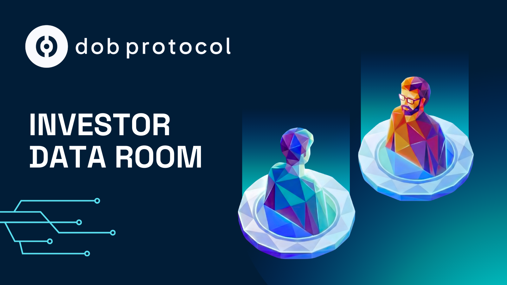

# Investor Data Room

DOB Protocol: Your entry point for Real World Asset Tokenization.

Real-world assets produce value. Financing them is slow, complex, and limited.

* Tokenization is expensive.
* **RWAs lack liquidity.** Secondary markets are promised but never materialize. Investors remain locked until maturity, unable to exit positions.
* Investors distrust what they cannot verify.
* Project Owners need capital without debt or dilution.

The RWA liquidity problem is structural: **$16 trillion in tokenizable assets remain trapped** because traditional secondary markets don't work for real-world assets. Projects remain underfunded. Value stays locked. Investors avoid what they cannot exit.

_20260122_175854_0000 (1).jpg>)


DOB Protocol connects real projects with global investors through on-chain infrastructure. Simple. Transparent. Compliant.

***

**Project Owners**

Raise capital without losing ownership or control.

***

**Financial Agents and Development Teams**

Offer tokenized products without internal teams. Scale with modular solutions and embedded compliance.

***

**Investors**

Invest through collective structures. Returns backed by auditable project performance.

* NO banks.
* NO dilution.
* NO traditional debt.

DOB Protocol transforms projects into verified, investable assets. Traceable. Compliant. Built for scale.


## THE SOLUTION: DOB PROTOCOL

**DOB Protocol** delivers 5 modular solutions for RWA tokenization. Scalable. Secure. Compliant.

.png>)




**The Core Problem:** RWA tokens sit illiquid after purchase. No viable secondary market exists. Investors are locked until maturity or forced into OTC deals that rarely happen. Liquidity pools collapse under stress because they lack real backing.

**Our Solution:** First Liquid RWA DEX. Powered by Uniswap v4 Hooks.

* Programmatic liquidity backed by real project revenue, not artificial market makers
* Partial exit at any time without waiting for maturity or OTC counterparts
* Minimum: USD 10.00
* Dynamic pricing based on real-time, auditable on-chain performance
* Native DeFi composability: AMMs, lending pools, vaults from day one

DOB Liquid DEX transforms RWAs from illiquid instruments locked for years into truly DeFi-native assets with real, stress-resistant liquidity.




Projects verified. Performance monitored on-chain. Only validated assets enter the DEX.

* Cryptographic proof of existence, operation, revenue
* Auditable trail eliminates information asymmetry
* Scoring based on real data
* Global investor access through verifiable credibility

DOB Validator is the entry point for verified tokenization.




Verified revenue packaged into RWA tokens. Creates liquid markets for real assets.

* Future revenue as collateral
* Investment Rounds without equity dilution
* Legal structure ready: tokenize in days
* Automated revenue distribution to investors

DOB Token Studio delivers capital access without intermediaries.




Sell tokens on your website. Simple and secure.

* Embeddable widget, no coding required
* Double yield: real revenue + DeFi returns
* Wallet integration: global distribution
* Direct sale without intermediaries



For Financial Agents and Development Teams. Offer tokenized products without internal teams. Scale through end-to-end or modular implementation.

* Ready APIs and reusable legal structures
* Operational dashboards for immediate use
* Compliance embedded
* Fast time to market: onboard enterprise clients in days

## How it Works



**Verify**

Projects validated. Performance data recorded on-chain via DOB Validator.



**Tokenize**

Verified revenue packaged into RWA tokens via DOB Token Studio. Transparent Investment Rounds.



**Invest and Trade**

Tokens listed on DOB Liquid DEX. Unlike traditional RWA platforms where tokens remain illiquid, investors trade freely with programmatic liquidity backed by real revenue. Exit anytime. Distribution via DOB Link.



**Financial Agents and Development Teams**

Integrate DOB Protocol solutions. Modular or end-to-end. Documented APIs. Ready legal structures.




DOB Protocol: complete software and legal compliance suite for RWA tokenization. Modular solutions combining on-chain infrastructure with regulated legal structures. Real projects access global capital without intermediaries.

We unlock billions in untapped project value across emerging markets. Where others see risk, we deliver proof. Verifiable validation. Transparent tokenization. Embedded compliance.

DOB Protocol is operational. Generating real value through EV charging tokenization. Fully functional DEX marketplace.


## TRACTION: OPERATIONAL PROOF POINTS

.jpg>)

### eHive: Operational Use Case

About the Project:

* Platform to manage, monitor, and monetize EV charging stations
* Focus: Santiago, Chile (Green Mobility)
* Website: [https://ehive.cc](https://ehive.cc/)

Figure: eHive project card showing APY and pool balance.

***

### Chargers in the Marketplace

Charger #173: Status "Trusted", available for purchase (Price USD 8.5K, APR 15%)\
Charger #171: Status "Trusted", available for Airdrop\
Charger #172: Status "Trusted", available for Airdrop

* USD 40K tokenized
* Tokens available for investment (purchase or airdrop)

***

### Metrics

Functional marketplace: [https://dobprotocol.com](https://dobprotocol.com/)

Location: El Bosque 433, Las Condes, Santiago, Chile

* USD 250K (tokenized assets)
* 10+ projects in pipeline
* USD 10M in tokenizable future revenue
* 7+ RWA platforms want to join DOB Protocol

***

### Pipeline

Bas 3: Tokenization in process

## RISKS & MITIGATIONS

DOB Protocol operates at the intersection of real projects, validated data, and on-chain liquidity. Main risks and mitigations:

<strong>Real-World Performance Risk</strong>

Physical assets may underperform, impacting yield.

**DOB Mitigation:** Only projects with validated performance and revenue are onboarded via DOB Validator. Underperforming assets cannot sustain token issuance.

<strong>Data Integrity &#x26; Trust Risk</strong>

Inaccurate or manipulated data affects investor confidence.

**DOB Mitigation:** Performance and revenue verified and recorded on-chain. Auditable. Tamper-resistant.

<strong>Liquidity Risk</strong>

RWA markets are structurally illiquid. Traditional secondary markets fail because they depend on manual market makers, OTC counterparts, or simulated liquidity that collapses under stress. Investors remain locked for years.

**DOB Mitigation:** DOB Liquid DEX addresses this through programmatic liquidity via Uniswap v4 Hooks backed by validated revenue streams—not artificial market makers. Liquidity scales with project performance and remains stable regardless of market conditions. Investors can exit partially or fully at any time.

<strong>Smart Contract &#x26; Protocol Risk</strong>

Smart contract vulnerabilities or integration failures may impact operations.

**DOB Mitigation:** Modular architecture. Staged deployments. Battle-tested DeFi primitives reduce systemic exposure.

<strong>Regulatory &#x26; Compliance Risk</strong>

Regulatory treatment of tokenized revenue may evolve.

**DOB Mitigation:** Focus on revenue participation, not asset ownership. Jurisdiction-aware onboarding. LATAM-first deployment.

<strong>Adoption &#x26; Execution Risk (Pre-Seed)</strong>

Project Owner adoption and early execution risks remain.

**DOB Mitigation:** Clear incentives for Project Owners (capital without debt or dilution). Operational proof points (eHive). Ecosystem partners.


**Risk Philosophy**

DOB Protocol does not remove risk. It makes risk visible, measurable, and liquid through verified performance and programmatic liquidity.


## Business Model

Sustainable. Scalable. Aligned with Project Owners and capital providers. DOB Protocol earns fees at protocol level through token flows. Token holders participate in platform growth.

### Investor-Side Fees

**Investment Fee:** 1.5% per contribution.

***

### Revenue-Share Fees

**Distribution Fee:** 0.5% of all project revenue, deducted before investor distribution.

***

### Validation + Tokenization Pricing

One-time fee for DOB Validator and tokenization. Price by project scale:

| Tier   | Fee (USD)   | Expected Project Type                             |
| ------ | ----------- | ------------------------------------------------- |
| Small  | USD 4,500   | Projects up to USD 250K, installations            |
| Medium | USD 9,000   | Projects between USD 250K–USD 1M                  |
| High   | USD 18,000+ | Large-scale or high-complexity projects (>USD 1M) |


**DOB White Label: Commercialization**

Commercialized under consultation. Adapted to specific needs of each Financial Agent or Development Team. Contact us for modular or end-to-end implementation, API integration, dashboards, and legal structures.


## WHO IT'S FOR: Buyer Personas



**Project Owners**

Access capital without dilution or debt. Transform productive projects into investable assets. Raise capital directly from global investors via DEX.

**Flow:**\
Validation via DOB Validator → Tokenization via DOB Token Studio → Distribution via DOB Link → Listing on DEX.

**Use cases:**

* SaaS platforms with monthly subscriptions
* Farms validating grain production
* Factories delivering products
* Mining fleets: GPUs and AI clusters
* Solar and renewable energy
* EV charging networks
* Industrial robots
* Data and IoT infrastructure


**Any Productive System can be addressed by DOB Protocol**

Any system generating reliable, measurable data qualifies. SaaS with subscriptions. Farm validating production. Factory delivering products. Performance becomes visible and verifiable. Any Productive System with measurable data can be tokenized.




**Financial Agents and Development Teams (Builders and Service Providers)**

Scalable infrastructure for real-world finance. Integrate tokenized revenue models through DOB White Label.

**Typical flow:**\
End-to-end or modular implementation via DOB White Label → Onboard enterprise clients → Operational dashboards → Embedded compliance.

**Benefits:**

* Scale without internal teams
* Fast time to market: days, not months
* Controlled costs: no custom development
* Total flexibility: modular implementation



**Investors (Retail and Institutional)**

Real returns backed by projects. Liquid RWA DEX. Transparent, verifiable, globally accessible.

**Typical flow:**\
Invest → Yields generated → Reinvestment/composability → Returns distributed on-chain.

**Benefits:**

* USD 10.00 minimum eliminates entry barriers
* **Real liquidity, not promises:** programmatic liquidity backed by revenue lets you exit anytime—no waiting for maturity or OTC deals
* Fair pricing based on auditable on-chain performance
* Native DeFi composability: use RWA tokens as collateral, leverage positions, or participate in yield strategies



## PRE-SEED Round Resume

## Projections

## TEAM

<table data-view="cards"><thead><tr><th></th><th></th><th></th><th data-hidden data-card-cover data-type="image">Cover image</th></tr></thead><tbody><tr><td><strong>Óscar Castillo</strong></td><td><em>Co-founder &#x26; CEO</em></td><td>10+ years in AI, blockchain, and scalable software. Led multiple successful projects.</td><td><a href="../.gitbook/assets/1720463970913.png">1720463970913.png</a></td></tr><tr><td><strong>Fernando Castillo</strong></td><td><em>Co-founder &#x26; CTO</em></td><td>Blockchain specialist. PhD candidate. 4 years developing decentralized solutions.</td><td><a href="../.gitbook/assets/Design sem nome (46).png">Design sem nome (46).png</a></td></tr><tr><td><strong>Simón Espínola</strong></td><td><em>Co-founder &#x26; COO</em></td><td>Leads operations and business execution. 10 years in business development across Latin America.</td><td><a href="../.gitbook/assets/1752805246370.png">1752805246370.png</a></td></tr></tbody></table>

## BUILDING MOMENTUM: OUR FIRST YEAR (2025)

.png>)

### Q1: Early Traction

* January: Prototype delivered in <24h (Red Pill Challenge — Virtuals)
* February: Best Consumer Product at Aleph Mantle Hackathon | 2nd place at AVAX Chile Pitch Demo Day
* March: Top50 startup LatAm by Rayuela (Lisk) | Selected for OdiseaLabs 2025 accelerator

***

### Q2-Q4: Recognition and Acceleration

* June: Finalists at ApeCon Miami 2025 | Finalists at Virtuals Hackathon 2025
* July: Winners of Stellar X Draper University Founder Residency 2025 | Winners of Founder School Incubator Program
* August: Winners of Stellar x Draper Embark Program
* September: Presented DOB Protocol at Meridian (Stellar)
* October: Winners of Lisk Buildathon by Crecimiento | Winners of Lisk Founder Residency at Edge City Patagonia
* November: Pitch presented at Crecimiento SWC
* December: Accepted into Uniswap Hook Incubator | Hosted DOB Machine Day 2025


DOB Protocol is built in the open. We work with Stellar, Draper U, Tellus Cooperative, and regional partners across Latin America. Scaling adoption, compliance, and on-chain interoperability. Our stack bridges Base (Investment Rounds) and Stellar (DeFi reinvestment), creating cross-chain capital efficiency.


## OUR PARTNERS & ECOSYSTEM

### Strategic Investors

* **Stellar:** Strategic investment (1%)
* **Draper University:** Strategic investment (1%)

***

### Accelerators & Incubators

* **Uniswap Hook Incubator:** Accepted to create the First Liquid RWA DEX
* **Stellar X Draper University:** Founder Residency (Winners)
* **Lisk Foundation:** Founder Residency at Edge City Patagonia (Winners)
* **OdiseaLabs:** 2025 accelerator

***

### Recognition

* **Stellar Build Award:** USD 143k
* **Top50 startup LatAm:** Rayuela (Lisk)
* **Crecimiento Startup World Cup:** Finalists (12 of 210+)
* **Meridian Conference:** Presentation at Stellar's flagship conference


**VISION**

Capital should flow to projects that produce value, not to opacity. DOB Protocol builds the rails. Project Owners raise capital from their communities. Financial Agents scale tokenization without internal teams. Anyone invests in real, verifiable yields through the Liquid RWA DEX.

Projects that work, earn, and share. Real World Asset Tokenization. Wired for the world.


## NEXT STEPS & CONTACT



**For Project Owners**

Want to tokenize your productive assets? Discover how DOB Protocol delivers capital without debt or dilution.

<a href="../dob-solutions/dob-validator.md" class="button primary">Learn More</a>



**For Investors**

Invest in tokenized Real World Assets. Start with USD 10.00.

<a href="https://home.dobprotocol.com/explore" class="button primary">Explore Marketplace</a>



**For Financial Agents and Development Teams**

Scalable infrastructure for real-world finance. DOB White Label: modular solutions without internal teams.

Explore the documents. For presentation or founder introduction:

* [simon@dobprotocol.com](mailto:simon@dobprotocol.com)
* [oscar@dobprotocol.com](mailto:oscar@dobprotocol.com)

Scheduling individual demos and live Q\&A for stakeholders.



### Important Links



**Company**

* [Company Information](https://shorturl.at/dksFb)
* [Cap-table](https://docs.google.com/spreadsheets/d/18u5HXZe5cHt50vz59uaHeEjZfMJd8nCRGjFvCIx9b8c/edit?gid=196707966#gid=196707966)
* [Traction](https://docs.google.com/document/d/1CaBVkwbT9tFt7HaLLzcbHIRy6F1t7zA9MWx41-gGD08/edit?tab=t.0#heading=h.z4955cmp761e)



**Resources**

* [Deck](https://docs.google.com/presentation/d/1jKRYZnN_-2IHszJzEJ7PBatzGwNjaczp2q8qtwNM9Ho/edit?slide=id.p#slide=id.p)
* [Research and Development](../research-and-development.md)
* [Mission, Vision & Values](mission-vision-and-values.md)




**Legal Notice and Risk Disclaimer**

DOB Protocol is subject to Bermuda laws and exclusive jurisdiction of Bermuda courts. Operations through regulated structure (Class IIGB and DABA Class M) with statutory segregated accounts providing legal asset segregation. RWA token investments involve significant risks, including total loss of capital. Recourse limited to assets in specific segregated account. Protocol implements multiple risk mitigation layers: continuous performance validation, auditable on-chain recording, programmatic liquidity. Not available in prohibited jurisdictions (USA, OFAC-sanctioned, FATF-blacklisted countries). Past performance does not guarantee future results. Seek independent professional advice.


Last update: January 2026
