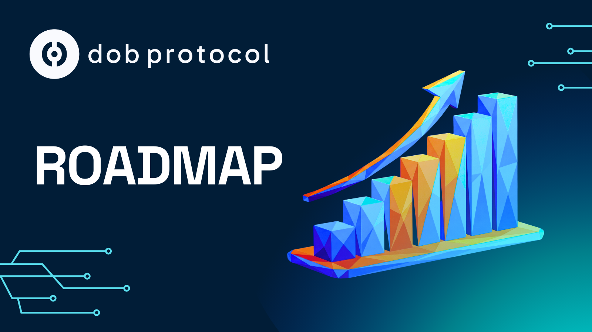

# Roadmap

<figure><figcaption></figcaption></figure>

Follow here the evolution of the DOB Protocol ecosystem and always be the first to know about our news and advances.

### Our traction comes from three main fronts:

* **Investors** who need a liquid, reliable and compliant DEX.
* **Projects** that need capital to finance their operations without capital dilution or loss of control.
* **Financial Agents and Development Teams** who want to offer RWA Solutions to their clients.

<figure><figcaption></figcaption></figure>


### Status January 2026

DOB Protocol has finalized integrations on the Stellar network and is advancing in the development of the 5 solutions that make up the ecosystem:

**Stellar Integrations**

* Finalized and operational.

***

**Dob Validator**

⚙️ Finalizing second prototype - validation system that requires verifiable proof of existence, operation and revenue generation before access to capital.

***

**Dob Token Studio**

⚙️ Tokenization and fundraising platform under development - verified project revenue packaged into investable digital assets.

***

**Dob Link**

⚙️ Finalizing first prototype - SDK for project onboarding, allowing Project Owners to offer access to their project tokens in a simple and secure way.

***

**Dob Liquid DEX**

⚙️ Approved in the Uniswap Hook Incubator Program to complete DOB Liquid DEX, introducing the concept of exit liquidity for RWA projects.

***

**DOB White Label**

⚙️ Modular solution for Financial Agents and Development Teams - will allow RWA assets to be managed and offered easily and at scale without the need to internally recruit internal teams of programmers and lawyers.


***

## Current Traction

DOB Protocol is generating traction on three main fronts:

### Investors

* 100 users currently receiving yield from electric vehicle charger deployments
* Functional marketplace at https://dobprotocol.com
* Minimum investment of USD 10.00 democratizes access to RWA

### Project Owners

* **eHive:** First operational physical RWA POC
* Active onboarding of additional projects through Dob Tutorials
* Pipeline with 10+ projects in validation process
* USD 250K in tokenized assets
* USD 10M in tokenizable future revenue identified

### Financial Agents and Development Teams

* More than 7 RWA platforms want to be on DOB Protocol
* Seeking access to Liquid RWA DEX for existing tokens
* Integration with DOB Protocol ecosystem for distribution and liquidity
* Interest in white label tokenization and distribution services
* Seeking scalable infrastructure without internal teams of programmers and lawyers
* Need for embedded compliance and modular legal structures

***

## Phases (Planning and Execution for 36 months)



#### Phase 1 (0-12 months): Foundation

**Focus:** Build trust, validate first projects and issue first tokens.

***

**OKRs**

* Launch Dob Validator MVP and onboard first Project Owners

⚙️ Finalize second prototype of Dob Validator with complete cryptographic validation system

⚙️ Launch Dob Token Studio as a validation-backed issuance platform

* Establish enforcement and insurance partnerships
* Finalize first prototype of Dob Link (SDK for onboarding)
* Enter Uniswap Hook Incubator to complete Dob Liquid DEX

***

**KPIs**

🔲 20+ validated projects (electric vehicle chargers, solar panels, data centers, SaaS platforms, farms, factories)

🔲 USD 5M+ in validated project revenue

🔲 First USD 1M tokenized via Dob Token Studio

🔲 3 enforcement/insurance partners signed

🔲 20 institutional and DeFi investors onboarded

🔲 100+ investors actively receiving yield



#### Phase 2 (12-24 months): Scale

**Focus:** Automate flows, expand to multiple countries and diversify products.

***

**OKRs**

🔲 Semi-automate Dob Validator by connecting projects to data endpoints

⚙️ Integrate Dob Token Studio with Dob Liquid DEX for Investment Round issuance

⚙️ Launch Dob Link as a distribution layer on DeFi and institutional platforms

⚙️ Expand to at least 3 Latin American markets (Chile, Peru, Mexico)

⚙️ Complete Dob Liquid DEX with incentive mechanism for exit liquidity

⚙️ Scale DOB White Label for Financial Agents

***

**KPIs**

🔲 500+ validated projects

🔲 USD 50M+ in validated project revenue processed

🔲 USD 20M tokenized and distributed

🔲 5 Investment Rounds launched via Dob Token Studio

🔲 100 active institutional and DeFi investors

🔲 10+ Financial Agents using DOB White Label



#### Phase 3 (24-36 months): Institutional Adoption

**Focus:** Achieve institutional-grade scale with automated and protected flows.

***

**OKRs**

🔲 Deploy autonomous validation with agents allocating capital without manual steps

🔲 Expand distribution of validated tokens in global secondary markets

🔲 Offer complete products with enforcement and insurance at scale

🔲 Position DOB Protocol as the default financial layer for RWA tokenization in Latin America

***

**KPIs**

🔲 5,000+ validated projects across the region

🔲 USD 500M+ in validated project revenue processed

🔲 USD 200M tokenized and distributed to investors

🔲 25+ enforcement and insurance agreements covering 90% of assets

🔲 Institutional adoption with 10+ banks and funds integrated

🔲 50+ Financial Agents using DOB White Label




**Legal Notice and Risks:** DOB Protocol is subject to the laws of Bermuda and the exclusive jurisdiction of the courts of Bermuda. Operations conducted through a regulated structure (Class IIGB and DABA Class M) with statutory segregated accounts that provide legal segregation of assets. Investments in Real World Asset (RWA) tokens involve significant risks, including total loss of invested capital. Recourse limited exclusively to assets linked to the specific segregated account. The protocol implements multiple layers of risk mitigation, including continuous performance validation, auditable on-chain registration and programmatic liquidity. Not available to residents of prohibited jurisdictions (including USA, OFAC sanctioned countries and FATF blacklisted countries). Past performance does not guarantee future results. Investors should seek independent professional advice.


***

**Last updated:** January 2026
